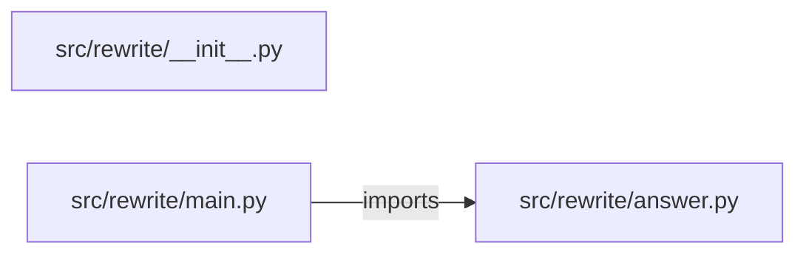

# rag-with-query-rewriting — project architecture

[README](README.md) · [Interview questions and answers](INTERVIEW_QA.md)

## Purpose and scope

Rewrite short slang (`pdb` → pod disruption budget) before retrieval.

This document describes files and symbols in this checkout. Deployment templates and statements in the original overview are distinguished from a verified running environment.

## Component diagram



For Python repositories, arrows show resolved local imports, not network calls or deployment order. Otherwise the diagram is a repository component map; containment arrows do not assert runtime integration.

## Components and responsibilities

| Component | Responsibility |
| --- | --- |
| [`src/rewrite/main.py`](src/rewrite/main.py) | HTTP handlers: `GET /healthz`, `POST /ask` |
| [`src/rewrite/answer.py`](src/rewrite/answer.py) | Functions: `words`, `rewrite`, `answer` |
| [`requirements.txt`](requirements.txt) | Implementation or supporting configuration |
| [`src/rewrite/__init__.py`](src/rewrite/__init__.py) | Implementation or supporting configuration |
| [`tests/test_ask.py`](tests/test_ask.py) | Executable checks and regression examples |
| [`.github/workflows/ci.yml`](.github/workflows/ci.yml) | GitHub Actions job definitions |
| [`README.md`](README.md) | Project explanations or operating notes |

## Request interface

| Method and path | Handler | Source |
| --- | --- | --- |
| `GET /healthz` | `healthz` | [`src/rewrite/main.py`](src/rewrite/main.py#L8) |
| `POST /ask` | `post_ask` | [`src/rewrite/main.py`](src/rewrite/main.py#L13) |

The table lists literal route decorators found in the inspected Python modules. Router prefixes and middleware can add behavior; check the linked handler and application setup before calling an endpoint.

## Implementation walkthrough

### `answer(question)`

Source: [`src/rewrite/answer.py`](src/rewrite/answer.py#L20).

Calls visible in this function: `len`, `ranked.append`, `ranked.sort`, `rewrite`, `words`.

```python
def answer(question):
    rewritten = rewrite(question)
    query = words(rewritten)
    ranked = []
    for name, text in PASSAGES:
        ranked.append({"source": name, "text": text, "overlap": len(query & words(text))})
    ranked.sort(key=lambda row: -row["overlap"])
    best = ranked[0]
    return {
        "rewritten": rewritten,
        "answered": best["overlap"] >= 2,
        "answer": best["text"] if best["overlap"] >= 2 else "No passage shares enough terms.",
        "citation": best["source"] if best["overlap"] >= 2 else None,
        "passages": ranked,
    }
```

### `rewrite(question)`

Source: [`src/rewrite/answer.py`](src/rewrite/answer.py#L12).

Calls visible in this function: `REWRITES.items`, `question.lower`.

```python
def rewrite(question):
    lowered = question.lower()
    for src, dst in REWRITES.items():
        if src in lowered:
            return question + " " + dst
    return question
```

### `words(text)`

Source: [`src/rewrite/answer.py`](src/rewrite/answer.py#L8).

Calls visible in this function: `re.findall`, `set`, `text.lower`.

```python
def words(text):
    return set(re.findall(r"[a-z0-9]+", text.lower())) - STOP
```

## Data and state

- [`src/rewrite/answer.py`](src/rewrite/answer.py) defines module-level containers: `PASSAGES`, `REWRITES`, `STOP`.

Module-level dictionaries/lists live in a Python process. They can be fixtures or mutable state; inspect writes before treating them as persistent storage. A production extension would need to define persistence and concurrency behavior explicitly.

## Data flow and design decisions

### What is the input-to-output contract of `answer`

In [`src/rewrite/answer.py`](src/rewrite/answer.py#L20), `answer(question)` receives the inputs. The function computes these intermediate values:

- `rewritten = rewrite(question)`
- `query = words(rewritten)`
- `ranked = []`
- `best = ranked[0]`

Its result is defined by:

- `{'rewritten': rewritten, 'answered': best['overlap'] >= 2, 'answer': best['text'] if best['overlap'] >= 2 else 'No passage shares enough terms.', 'citation': best['source'] if best['overlap'] >= 2 else None, 'passages': ranked}`

## Setup and verification

The following commands are derived from the checked-in dependency/test contracts. Execute them from the repository root; the block prepares a local environment, not a cloud deployment.

```bash
python3 -m venv .venv
source .venv/bin/activate
python -m pip install -r requirements.txt
python -m pytest -q
```

Python dependencies: [`requirements.txt`](requirements.txt).

Test entry points: [`tests/test_ask.py`](tests/test_ask.py).

Automation definitions: [`.github/workflows/ci.yml`](.github/workflows/ci.yml). Read their triggers and job steps to determine what CI actually runs.

## Operating boundaries and design review

Before turning this checkout into a customer deployment, establish the input contract, data ownership, access controls, failure response, evaluation criteria, and rollback owner. Repository fixtures and unit tests demonstrate local behavior; they do not establish throughput, uptime, compliance, or business impact.

A useful architecture review starts with the linked implementation: identify where input enters, where a decision is made, which state can change, and which external dependency can fail. Add a deployment view only for infrastructure that is actually configured and exercised.
